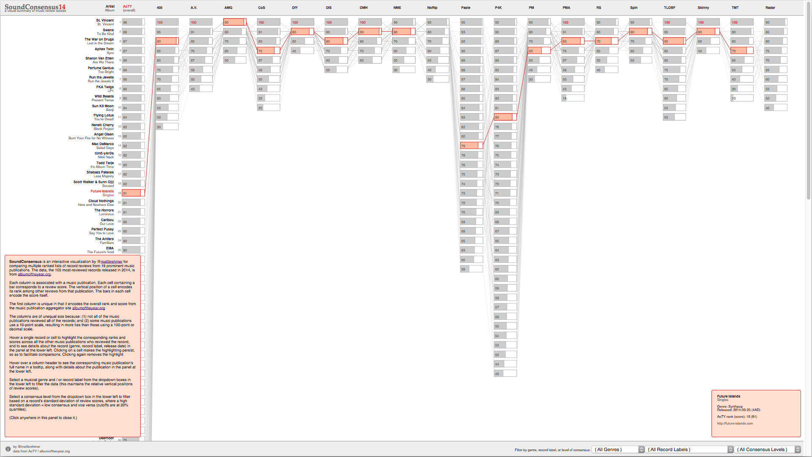
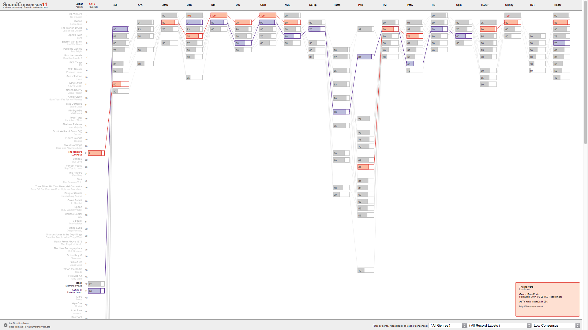

SoundConsensus
========

SoundConsensus is an interactive visualization for comparing multiple ranked lists of record reviews from 19 prominent music publications. The data, the 105 most-reviewed records released in 2014, is from [albumoftheyear.org](http://www.albumoftheyear.org/ratings/overall/2014/15).

[Experience SoundConsensus](http://bl.ocks.org/mattbrehmer/raw/9004f31b95a192af18df/).

Each column is associated with a music publication. Each cell containing a bar corresponds to a review score. The vertical position of a cell encodes its rank among other reviews from that publication. The bars in each cell encode the score itself.

The first column is unique in that it encodes the overall rank and score from the music publication aggregator site [albumoftheyear.org](http://www.albumoftheyear.org/ratings/overall/2014/15).

The columns are of unequal size because: (1) not all of the music publications reviewed all of the records; and (2) some music publications use a 10-point scale, resulting in more ties than those using a 100-point or decimal scale. 

Hover a single record or cell to highlight the corresponding ranks and scores across all the other music publications who reviewed the record, and to see details about the record (genre, record label, release date) in the panel at the lower left. Clicking on a cell makes the highlighting persist, so as to facilitate comparisons. Clicking again removes the highlight.

Hover over a column header to see the corresponding music publication's full name in a tooltip, along with details about the publication in the panel at the lower left.

Select a musical genre and / or record label from the dropdown boxes in the lower left to filter the data (this maintains the relative vertical positions of cells).

Select a consensus level from the dropdown box in the lower left to filter based on a record's standard deviation of review scores, where a high standard deviation = low consensus and vice versa (cutoffs are at 20% quantiles).
