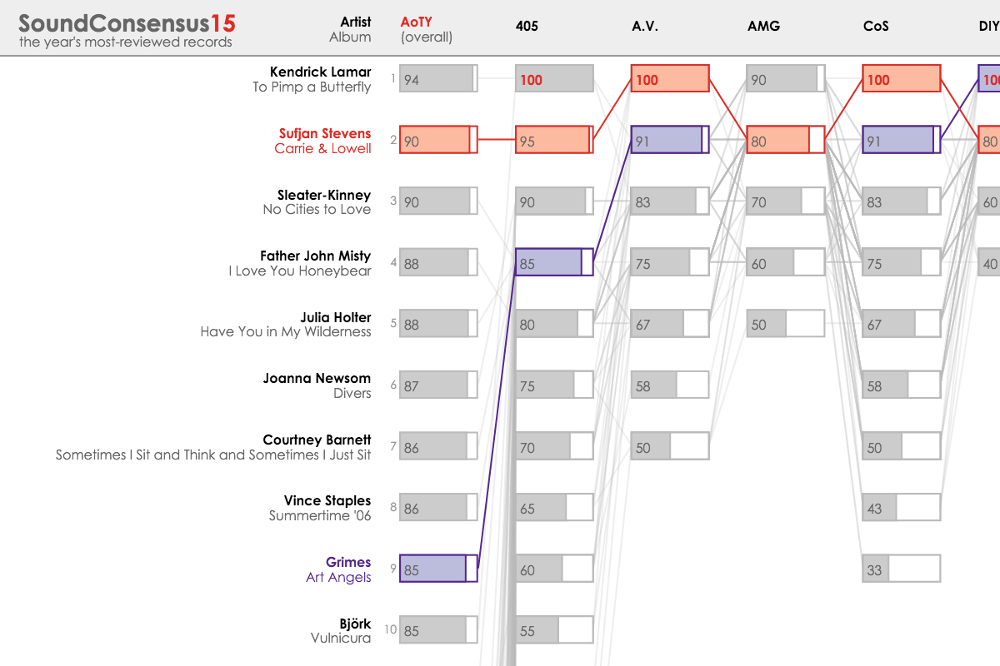
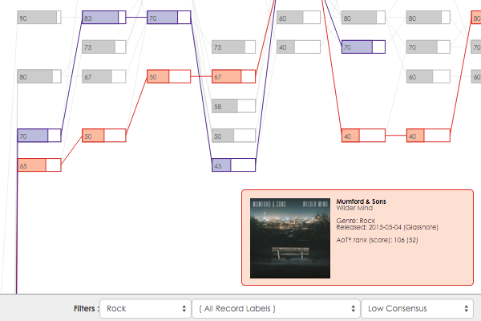

SoundConsensus
========

__SoundConsensus__ is an interactive visualization by [@mattbrehmer](https://twitter.com/mattbrehmer) for comparing multiple ranked lists of record reviews from 19 prominent music publications. The data visualized here represents the  most-reviewed records released in 2015, according to the music publication aggregator site [albumoftheyear.org](http://www.albumoftheyear.org/ratings/overall/2015/16).

[SoundConsensus 2015](http://mattbrehmer.github.io/SoundConsensus/2015/)

[SoundConsensus 2014](http://mattbrehmer.github.io/SoundConsensus/2014/)

__Visual Encoding__: Each column is associated with a music publication. Each cell containing a bar corresponds to a review score. The vertical position of a cell encodes its rank among other reviews from that publication. The bars in each cell encode the score itself.

The first column is unique in that it encodes the overall rank and score calculated by [albumoftheyear.org](http://www.albumoftheyear.org/ratings/overall/2015/16).

The columns are of unequal size because: (1) not all of the music publications reviewed all of the records; and (2) some music publications use a 10-point scale when rating a record, resulting in more ties than those using a 100-point or decimal scale.

__Interaction__: Hover over a record's artist or name to highlight the ranks and scores across all of the music publications who reviewed the record, and to see details about the record (such as genre, record label, and release date) in the panel at the lower left.

You can also hover over any cell. Clicking on a cell makes the highlighting persist, which can facilitate comparisons between records. Clicking again removes the highlight.

Click on an artist name or album name to visit corresponding [albumoftheyear.org](http://www.albumoftheyear.org/) artist and album profile pages, which contain links to the original reviews.

Hover over a column header to see the corresponding music publication's full name in a tooltip, along with details about the publication in the panel at the lower left.

__Genre / Record Label Filtering__: Select a musical genre and / or record label from the dropdown boxes in the lower left to filter the list of records (filtering maintains the relative rank positions of review scores).

__Consensus Filtering__: Select a consensus level from the dropdown box in the lower left to filter based on a record's standard deviation of review scores, where a high standard deviation corresponds to a low consensus, and vice versa.
